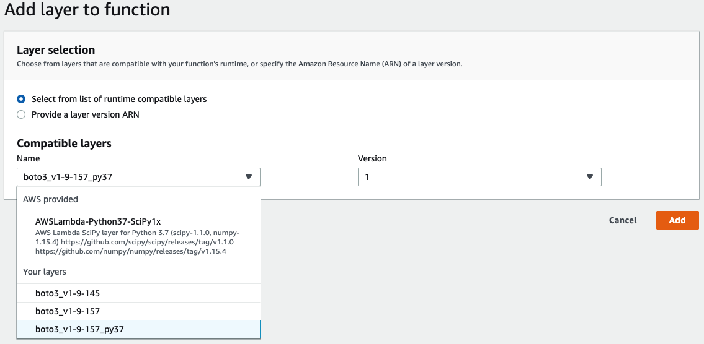
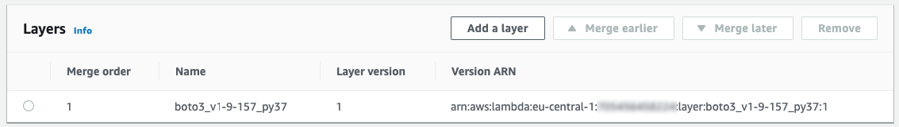

# boto3-lambda-layer
Shell script that creates an AWS Lambda Layer with the specified (or latest) version of boto3.

## WHY?

As you may or may not know, Lambda does not come with the latest version of [boto3](https://boto3.amazonaws.com/v1/documentation/api/latest/index.html) (the AWS SDK for Python). 

As of today (29 May 2019), the version provided in Lambda is 1.9.42 (10 Nov 2018) while the latest version available is 1.9.158. And it changes quite often, as new services or new features appear.

So if you need APIs that were announced after November 2018 (everything from re:Invent for example), you need to provide the desired version of boto3 in your Lambda package. 

With boto3, comes botocore and few other dependencies for a total of 8.3 MB. It seriously enlarges your package and worse, it can slow down the deployment of your Lambda function.

Hopefully, in November 2018, were announced the [Lambda Layers](https://aws.amazon.com/blogs/aws/new-for-aws-lambda-use-any-programming-language-and-share-common-components/) that provide shareable code and libraries between functions.

This shell script provides an easy way to create a Lambda Layer with the latest or specified version of boto3, so that you benefit from the desired version without embedding the library in each Lambda function.

## HOW?

### Pre-requisites

* Docker: [https://docs.docker.com/install/]()
* AWS CLI: [https://aws.amazon.com/cli/]()
* jq: [https://stedolan.github.io/jq/]()

### Usage

``./create_boto3_layer.sh [-h | --help] [-b= | --boto3=] [-p= | --python=] [-r= | --region=] ``

 	 -b | --boto3 : (Optional) Specify the version of boto3.
 			 If not specified, will retrieve the latest version.
 			 
 	 -p | --python : (Optional) Specify the version of python for which you want to create the Layer.
 			 If not specified, will create for all versions of python.
 			 Possible values: 2.7 | 3.6 | 3.7

 	 -r | --region : (Optional) Specify the region in which you want to create the Layer.
 			 If not specified, use the region configured with AWS CLI.
 			 
### Samples

``./create_boto3_layer.sh``
will retrieve the latest version of boto3 and create a Layer compatible with all versions of python supported in Lambda (2.7, 3.6 and 3.7) in your default region:

    python
      lib
        python2.7
          site-packages
            boto3
            botocore
            ...
        python3.6
          site-packages
            boto3
            botocore
            ...
        python3.7
          site-packages
            boto3
            botocore
            ...
          
(see [documentation](https://docs.aws.amazon.com/lambda/latest/dg/configuration-layers.html#configuration-layers-path))

``./create_boto3_layer.sh --boto3=1.9.157 --python=3.7 --region=eu-west-1`` 
will retrieve version 1.9.157 of boto3 and create a Layer compatible with python 3.7 in eu-west-1.

### Add the Layer to a function
When the script is done, it provides the Layer ARN, that you can use in any compatible Lambda function.

#### With the CLI
You can just type:

``aws lambda update-function-configuration --layers arn:aws:lambda:region:account:layer:boto3_v1-9-157_py37:1 --region my-region --function-name my-function``

#### Within the console:

First select the Layers in your function and click "Add a layer":


Then, choose the appropriate Layer (compatible with your Lambda runtime) and click "Add":



Finally, verify Layers associated to your Lambda:



### Test
In your python code, you can get the boto3 version like this:

```python
import boto3

def lambda_handler(event, context):
    print("boto3="+ boto3.__version__)
```

Then you should get the correct version:

